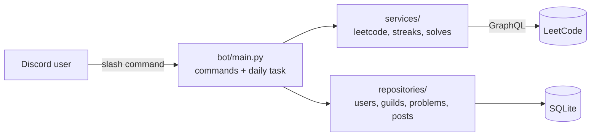

# DailyCode Bot

[](https://github.com/fatmaalobeidli/dailycode-bot/actions/workflows/ci.yml)

A Discord bot that turns the **LeetCode daily challenge** into a group habit.

It posts the daily problem to configured Discord servers, verifies accepted submissions through LeetCode, and maintains per-user streaks, points, and per-server leaderboards.

Built with Python, `discord.py`, SQLite, and LeetCode's GraphQL API.

<!--
Screenshots: add images to docs/screenshots/ and remove this comment block.


-->

## Example

```text
/daily
→ Reverse Substrings Between Each Pair of Parentheses
  Difficulty: Medium · Acceptance: 75.1% · Topics: String, Stack, Bracket Sequences

/solved
→ ✅ Reverse Substrings Between Each Pair of Parentheses
  @fleur solved today's problem!  Points: +2 · 🔥 Streak: 1 · Longest: 1

/leaderboard
→ 🥇 @fleur · 🔥 1 · ⭐ 2
```

## Features

| Command | Description |
|---|---|
| `/daily` | Shows today's LeetCode problem with difficulty, acceptance rate, and topics |
| `/link <username>` | Links your Discord account to a LeetCode account and checks that the user exists |
| `/solved` | Checks recent accepted LeetCode submissions for today's challenge and records the solve |
| `/streak [member]` | Shows current streak, longest streak, points, and total solves for you or another member |
| `/leaderboard [by]` | Shows the server's top 10 users ranked by streak or points |
| `/setup <channel>` | **Admin:** selects the channel used for automatic daily posts |
| `/postnow` | **Admin:** posts today's challenge to the configured channel immediately |
| `/ping` | Health check with bot latency |

**Automatic daily post:** every day at 00:05 UTC, shortly after LeetCode publishes the new challenge, the bot posts it to every configured server.

**Scoring:** Easy = 1 point, Medium = 2 points, Hard = 3 points.

## How it works

- **Verified solves instead of an honor system.**  
  `/solved` checks the user's recent accepted LeetCode submissions and only records today's challenge if the accepted submission matches the current daily problem and was completed today in UTC.

- **Streaks expire correctly.**  
  A streak remains active if the user's most recent solve was today or yesterday. Otherwise, the displayed active streak becomes 0.

- **Transactional solve updates.**  
  Recording a solve and updating streak and point values happen in a single database transaction, reducing the risk of partial updates if an operation fails. A composite primary key prevents the same user from receiving credit twice for the same daily challenge.

- **Reliable scheduled posting.**  
  The bot posts the daily challenge at the configured time, tracks daily posts per server to avoid duplicates, and can check for missed posts when restarting after downtime.

- **External API isolation.**  
  LeetCode does not provide an official public API for this use case. All GraphQL communication is isolated inside one service module behind a small interface and a single custom error type. If LeetCode changes its response format, the rest of the bot remains largely unaffected.

## Architecture



```text
bot/
├── main.py              # Discord client, slash commands, daily post loop
├── db.py                # database connection and schema
├── services/            # business logic and external API integration
│   ├── leetcode.py      # GraphQL queries, parsing, error handling
│   ├── streaks.py       # streak rules as pure functions
│   └── solves.py        # solve verification rules and point calculation
└── repositories/        # database queries and persistence
    ├── users.py
    ├── guilds.py
    ├── problems.py
    └── posts.py

tests/                   # pytest tests, one file per module
```

The architecture keeps business logic separate from Discord and database code.

For example:

- `streaks.py` and `solves.py` contain testable business logic
- `leetcode.py` isolates all external API communication
- repositories contain database queries
- `main.py` handles Discord-specific behavior and command orchestration

This makes the core functionality testable without requiring a Discord connection or live LeetCode requests.

## Tech stack

- **Python 3.10+**
- **discord.py 2**: slash commands and scheduled tasks
- **aiohttp**: asynchronous HTTP requests
- **aiosqlite**: asynchronous SQLite access
- **pytest** + **pytest-asyncio**: automated testing
- **ruff**: linting and formatting

## Getting started

### 1. Create a Discord application

1. Go to the [Discord Developer Portal](https://discord.com/developers/applications) and create a new application.
2. Open the **Bot** section, reset the bot token, and copy it.
3. Open **OAuth2 → URL Generator**.
4. Select:
   - `bot`
   - `applications.commands`
5. Grant the required permissions:
   - **View Channels**
   - **Send Messages**
   - **Embed Links**
6. Open the generated URL and invite the bot to your Discord server.

> Never commit or publicly share your Discord bot token.

### 2. Install

```bash
git clone https://github.com/fatmaalobeidli/dailycode-bot.git
cd dailycode-bot

python -m venv .venv
```

Windows:

```bash
.venv\Scripts\activate
```

macOS / Linux:

```bash
source .venv/bin/activate
```

Install dependencies:

```bash
pip install -r requirements.txt
```

### 3. Configure

Copy `.env.example` to `.env` and add your configuration:

```env
DISCORD_TOKEN=your-bot-token
DEV_GUILD_ID=your-test-server-id
DB_PATH=dailycode.db
```

`DEV_GUILD_ID` is optional and can be used during development so slash commands sync immediately to a test server.

`DB_PATH` is optional and defaults to `dailycode.db`.

### 4. Run

```bash
python -m bot.main
```

The SQLite database is created automatically on first start.

Inside Discord:

1. Run `/setup` to choose the channel used for daily challenges.
2. Run `/link <username>` to connect your LeetCode account.
3. Use `/daily` to view today's challenge.
4. After solving it on LeetCode, run `/solved`.

> Your LeetCode submission history must be publicly accessible for `/solved` to verify your accepted submission.

## Deployment

The bot runs in Docker. The SQLite database is stored in `./data` on the host, so it survives restarts and rebuilds.

```bash
git clone https://github.com/fatmaalobeidli/dailycode-bot.git
cd dailycode-bot
cp .env.example .env        # add your token
docker compose up -d --build
docker compose logs -f      # follow the logs
```

`restart: unless-stopped` brings the bot back automatically after a crash or a server reboot.

To update after pushing new code:

```bash
git pull
docker compose up -d --build
```

## Tests

Run the test suite:

```bash
python -m pytest -v
```

Run linting:

```bash
ruff check .
```

The test suite covers areas such as:

- streak behavior
- month and date boundaries
- LeetCode response parsing
- solve detection
- repository operations against temporary SQLite databases

## Limitations

- LeetCode's GraphQL interface is unofficial and may change. All GraphQL-related code is isolated in `bot/services/leetcode.py`.
- The submission verification logic checks a limited number of recent accepted submissions. If the daily solve falls outside that query window, `/solved` may not detect it.
- The bot normally posts the daily challenge at 00:05 UTC. If it is offline at that time, it checks for missed daily posts after restarting.
- LeetCode account linking depends on publicly accessible LeetCode profile and submission data.

## License

This project is licensed under the [MIT License](LICENSE).
